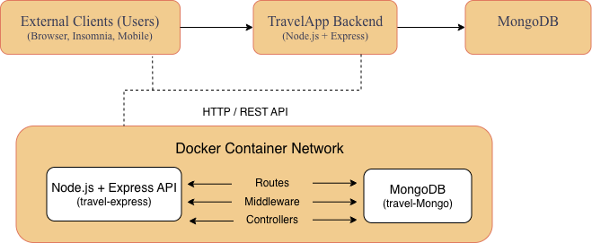
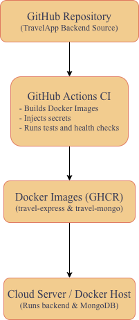
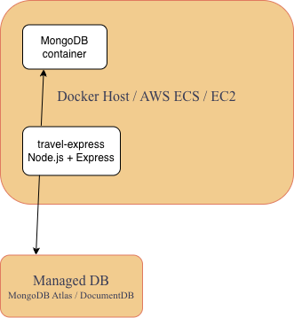
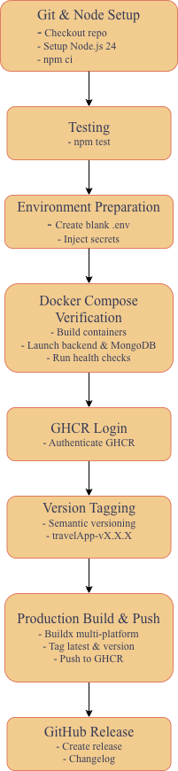

# TravelApp Backend Architecture Diagram 

## Introduction
The TravelApp backend project focuses on developing a scalable, secure, and maintainable server-side application for managing travel-related data. The backend is designed to provide a robust API for future frontend clients, such as web or mobile applications, allowing users to create trips, manage destinations, and track activities efficiently. The system leverages modern technologies including Node.js with Express for the application server, MongoDB for permanent storage, and Docker for containerisation to ensure consistent and portable environments. Furthermore, automated CI pipelines are implemented using GitHub actions to streamline development workflows, enforce best practices in security through secret management, and enable potential cloud deployment on platforms such as AWS. This project demonstrates professional backend engineering practices, cloud readiness and adherence to modern DevOps principles.

## Project Overview
The TravelApp backend is a Node.js and Express-based application, designed to manage travel-related data including users, destinations, trips, activities, vaccination requirements and packiing essentials. MongoDB serves as the primary database, storing all persistent data in a structured, flexible format. The backend is containerised using Docker and orchestrated with Docker compose, ensuring consistent development, testing and deployment environments.

CI automation is implemented through GitHub actions, which builds Docker images, injects secrets, runs services using Docker Compose, and validates health checks. The system is designed with possible cloud deployment in mind, enabling deployment to AWS services such as ECS or EC2, with MongoDB either containerised or hosted as a managed service. This architecture ensures scalability, security and maintainability.

## Application Architecture

### Logical Architecture Diagram

This diagram represents the backend's logical structure. External clients, such as Insomnia, a web browser, or a frontend, communicate with the Express API via HTTP requests. Express handles routing, middleware, and business logic before interacting with MongoDB, which stores all persistent travel data. Both services run in Docker containers, connected through a shared bridge network to ensure secure internal communication and environment consistency. The Express container depends on MongoDB, and both containers are orchestrated using Docker Compose. This design supports scalability, maintainability and portability. Additional services can be integrated in the future without restructuring the core system.

### Deployment and Infrastructure Architecture Diagram

This diagram illustrates the CI pipeline and potential cloud deployment. Code pushed to GitHub triggers GitHub Actions, which builds Docker images for the Express backend, injects secrets and launches the backend and MongoDB containers via Docker Compose. Automated health checks ensure both services are functioning before the pipeline completes.

For cloud deployment, the containerised backend can run on AWS ECS or EC2, with MongoDb either containerised or managed via MongoDB Atlas. This architecture ensures secure, scalable and cloud-ready deployment, reflecting professional practices.

### GitHub Actions Workflow

The backend project implements a fully automated CI workflow usiing GitHub Actions. This workflow triggers on pushes to the `release` branch or when version tags matching `v*` are created. It automates testing, verification, containerisation, semantic versioning and production image building.

### Workflow Highlights
**1. Git and Node Setup:** Full repository checkout and Node.js 24 setup. Dependencies are installed using `npm ci`. 

**2. Testing:** Automated tests are run `npm test` to ensure only verified code proceeds.

**3. Environment Preparation:** A blank `.env` is created for Docker Compose verification, with sensitive secrets injected securely.

**4. Docker Compose Verification:**  Containers for Express and MondoDB are built and launced for testing, then closed to ensure a clean environment.

**5. GHCR Login:** The workflow securely logs into GitHub Container Registry for production image pushes.

**6. Version Tagging:** Semantic versioning is automated, generating tags like `travelApp-vX.X.X.

**7. Production Image Build and Push:** Buildx is used to create a multi-platform images tagged with both `latest` and versioned tags, then pushed to GHCR.

**8. GitHub Release:** A release is created automatically, including changelog.
